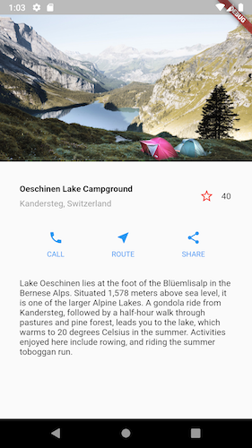
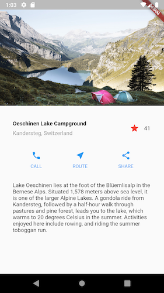
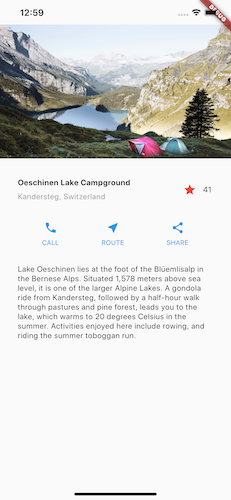

# Adding Interactivity to Flutter App

Learned how to respond to taps, create a custom widget, and the difference between stateless and stateful widgets

## Links
## Links
<a href="https://flutter.dev/docs/development/ui/interactive" target="_blank">Adding Interactivity Tutorial Guide</a>
 
<a href="https://flutter.dev/docs/reference/tutorials" target="_blank">More Tutorials</a>

## Android Screenshots

   

## iOS Screenshots

   