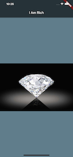

# London App Brewery Flutter Tutorial - I Am Rich App

Simple Flutter App that uses an AppBar, Scaffold, and Image

## Links
<a href="https://www.youtube.com/playlist?list=PLSzsOkUDsvdtl3Pw48-R8lcK2oYkk40cm" target="_blank">Youtube Course - How to Build Flutter Apps for iOS and Android</a>
 
<a href="https://appicon.co/" target="_blank">Create App Icon</a>

## Android Screenshot

## iOS Screenshot

